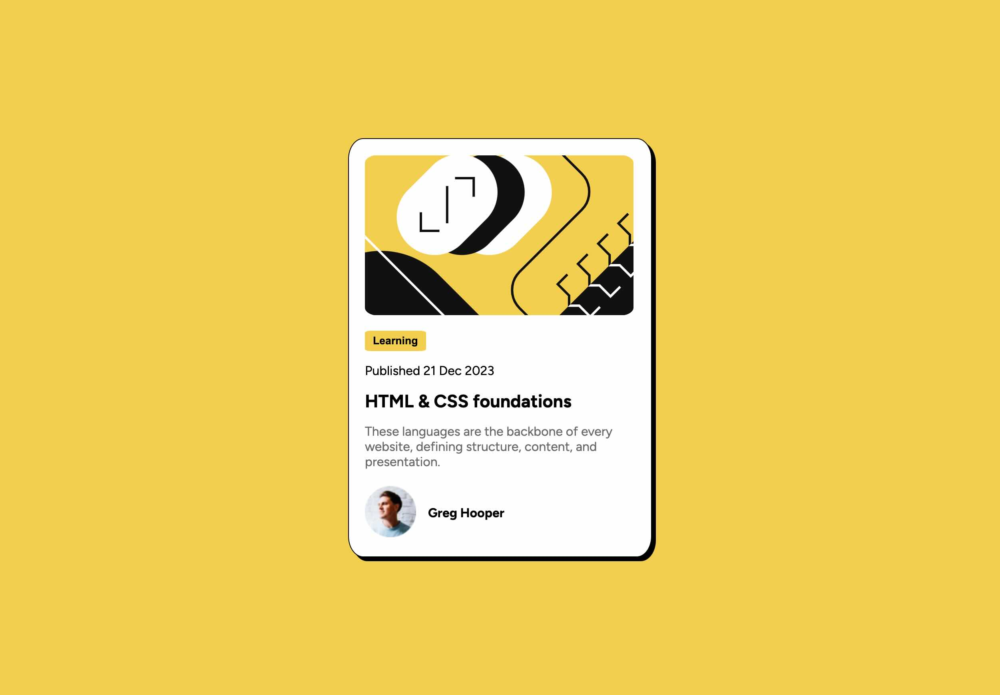

## Overview

### Screenshot

### Links

- Solution URL: [RH-Nix Solution](https://rh-nix.github.io/FEM-qr-code-challenge/)

## My process
The HTML portion was easy. When it came to CSS specifically flexbox it became a bit diffucult to move things around.

### Built with

- Semantic HTML5 markup
- CSS custom properties
- Flexbox
- CSS Grid
- Mobile-first workflow

### What I learned
How to use flexbox and position to move elements around. Margin: 0 auto to center elements horizontally

### Continued development

Satisfied for now

### Useful resources

- [MDN Flexbox](https://developer.mozilla.org/en-US/docs/Learn/CSS/CSS_layout/Flexbox)
- [Learn Flexbox](https://www.youtube.com/watch?v=phWxA89Dy94&list=PLCn4lnZBxczR7vKjycPFwmW7-YlCI0mpp&index=8) - Helped me figure out where I was going wrong when trying to position items.

## Author
- Frontend Mentor - [@RH-Nix](https://www.frontendmentor.io/profile/RH-Nix)

